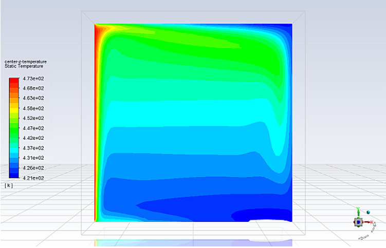
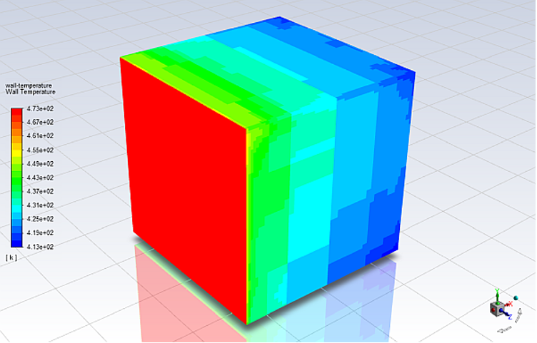
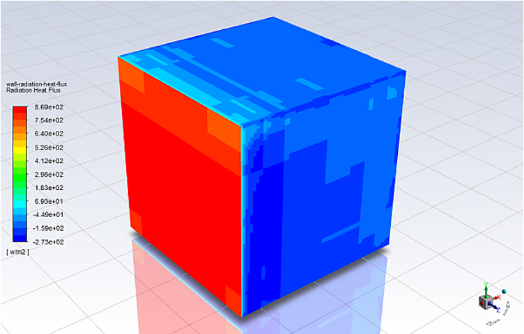

## Piezo-induced shear-mode resonant acoustic excitations of meshed boiling-surfaces for enhanced flow-boiling operations for next generation heat-sinks
A novel flow boiling using micro-nucleation to cool electronic chips is developed. 
  
  
  <em>Contour of static temperature</em>
  
  
  
  
  

  <em>Contour of wall temperature</em>  
  
  
  
  
  
  <em>Contour of radiation heat flux</em> 
  
  
  
  
  
  
  <em>Vector of velocity magnitude</em>
    
