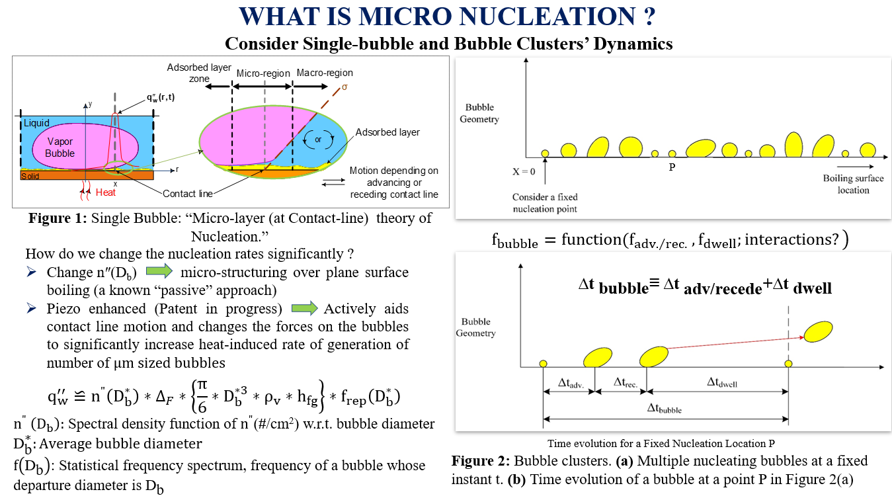

## Piezo-induced shear-mode resonant acoustic excitations of meshed boiling-surfaces for enhanced flow-boiling operations for next generation heat-sinks
A novel flow boiling using micro-nucleation to cool electronic chips is developed. 
  
  
 
