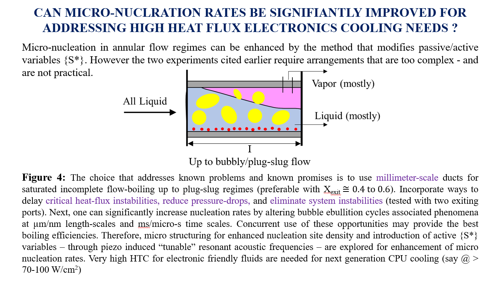

## Piezo-induced shear-mode resonant acoustic excitations of meshed boiling-surfaces for enhanced flow-boiling operations for next generation heat-sinks

**A novel flow boiling approach using micro-nucleation to cool electronic chips is developed.**
**The nucleation rates are enhanced using structured surfaces and piezo-electric transducer to tackle the future high heat dissipation rates of more that 100 watt/sq.cm. Such large amount of heat will be too difficult and chalenging to dissipate by the present day liquid cooling approach. A new approach involving flow boiling to further enhance the heat dissipation is proposed in my research.**

  
  
  
  
  
  
  
  
  
  
  
  
  
  
  
  
  

  
 
