## Flow Classification Using Machine Learning
Classified the following flow as NRe driven flow "ascending flow", NFr driven flow "draining flow" and a mixture "mixed flow" using machine learning.
Developed a fuzzy c mean clustering code using python to classify the flow type.

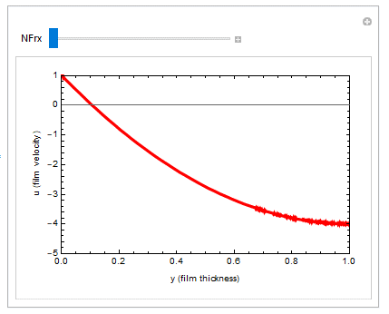
<em>Above Given is The Input Data</em>

Following results were obtained using the developed algorithm

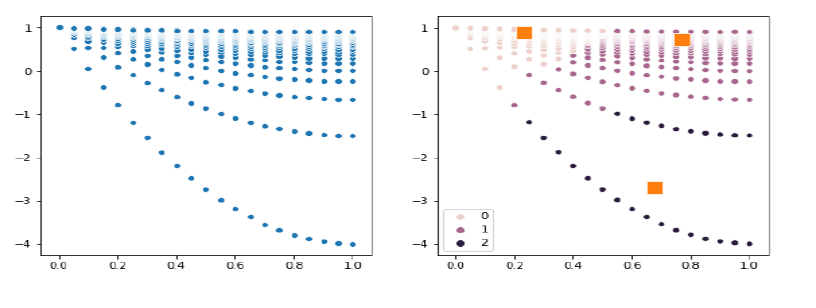
<em>Result</em>

Class "0" represents mixed flow, class "1" represent ascending flow and class "2" as draining flow.

## Asymptotic (Perturbation) solution of an oscillator
A comparision is made between the exact solution and an asymptotic solution generated using Mathematica to solve the linear oscillator weak damping equation.
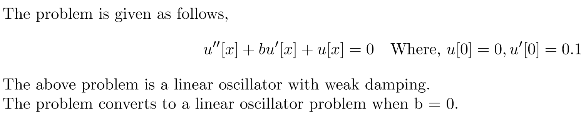

**Following are the obtained solutions for various assumptions of the asymptotic coefficient b**

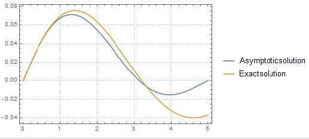
<em>x=5, b=0.4</em>

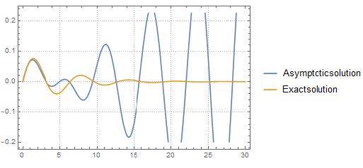
<em>x=30, b=0.4</em>

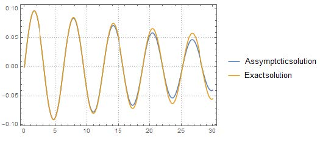
<em>x=30, b=0.04</em>

## Blassius Boundary Layer Equation for the Prandtl Boundary Layer Theory

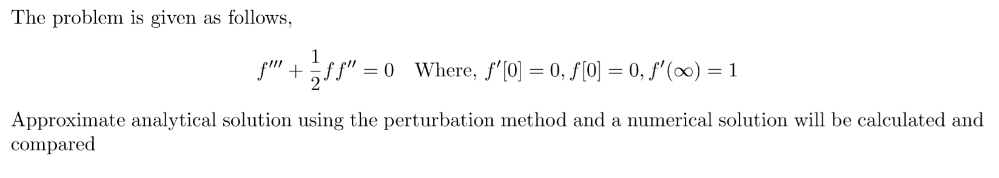

**Following are the obtained solutions**

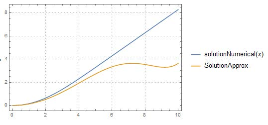
<em> Comparison of Numerical and Approximate solution for a boundary layer of thickness(x) = 10. The boundary layer ranges from x = 0 (near surface) to x = 10 (Free stream)</em>

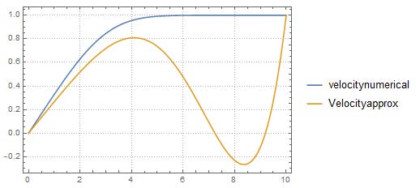
<em> Comparison of Numerical and Approximate velocity profile for a boundary layer of thickness(x) = 10. The boundary layer ranges from x = 0 (near surface) to x = 10 (Free stream)</em>

## Transitions in the KURAMOTO-SIVASHINKSY equation

**The KURAMOTO-SIVASHINKSY equation is given by**

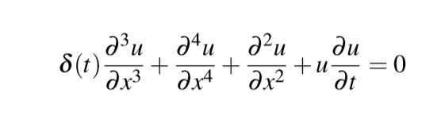

Following is the plot for the data set

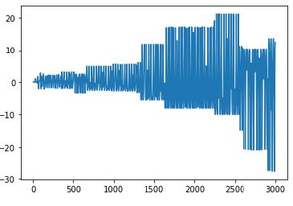
<em>Data set plot where Y axis represents the spatial location of data set and X axis represent the nth data set</em>

The following data set clearly shows the role of advective and diffusive terms. It can be seen that after each time step the variation of the spatial location increases in magnitude. The reason behind this is the 2nd and the 4th order equation.

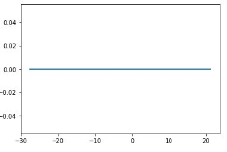
<em>1D plot of the data</em>

**Flow Classification**
The fuzzy-C-mean clustering approach is used for classifying the data. This approach allows the data to be within one or more clusters. It assigns a membership value to each data point. The summation of the membership value is 1 and its magnitude for a particular group determines the closeness of that point to the respective cluster.

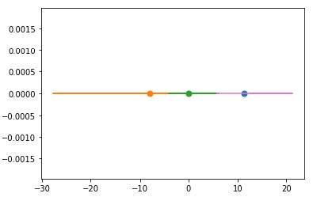
<em>Clustered data showing different classes of data set with their respective centers</em>

