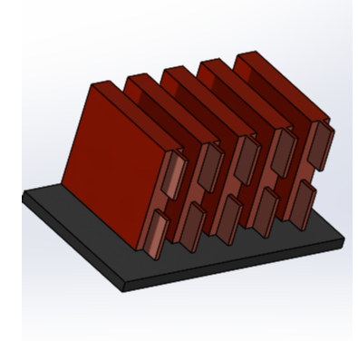
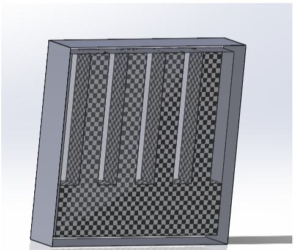
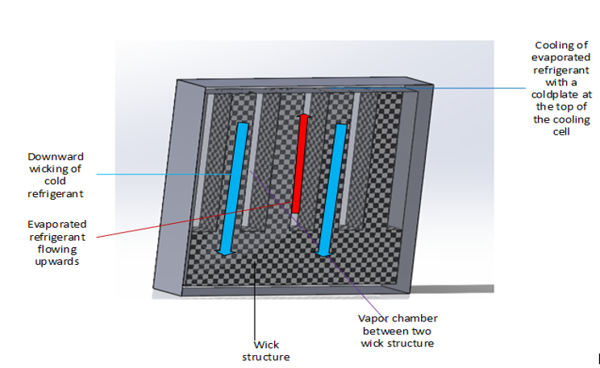
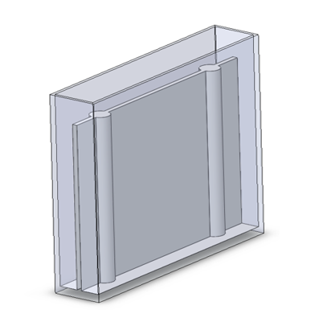
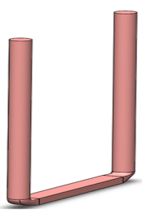
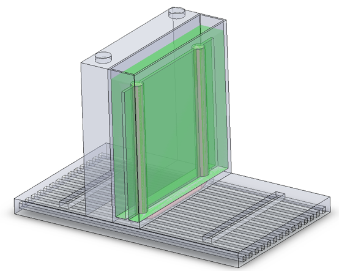
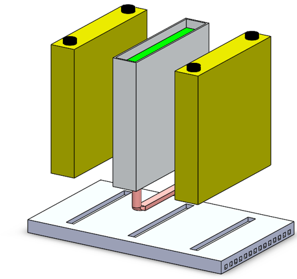
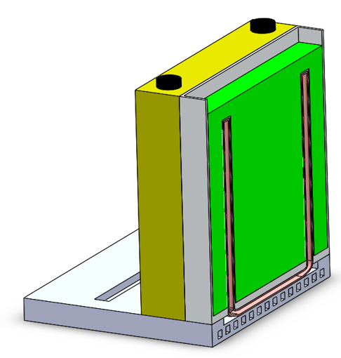

## Thermal management of electric vehicle battery during ultra-fast charging
Ultra-fast charging involves charging a 50 KWh Li-Ion battery within 10-15 minutes. During which around 50W amount of energy is released from a single cell.
The temperature of the battery has to be below 45 degree C so as to avoid a significant reduction in performance as well as life time. 
A cellular level thermal management approach was developed. 

**Preliminary cellular level approach of battery cooling**
A battery is made up of multiple cells as shown in the below figure. The cells are combine together to form a battery module. Multiple modules are brought together to form a battery stack. 

  
  
  <em>Battery cells combined together to form a module</em>
  

**Physics behind cooling cell**
Figure below shows a cooling cell which was initially designed to be placed within two battery cells. 
The cooling cell involved a wick structure which is shown in the figure below as black and white square finish.
The wicking structure is made up of either a copper wick or a polyester material.
The bottom part of the wick has refrigerant in it which absorbs the heat and evaporates and moves upward through the blank space (vapor-chamber) which is cooled at the top and wicked back to the bottom.
This way a continuous cycle of evaporation, condensation and wicking is created due to the heat generated by the internal chemical reaction of the battery.
Thus the battery cell is effectively cooled by the above mentioned cycle.

  
  
  <em>Cooling Cell</em>
  
  
  
  
  
  <em>Working of Cooling Cell</em>
  

**Results and Conclusion from preliminary design**
The previously mentioned cooling cell had a major drawback. 
There was a temperature gradient of more than 5 degree C  across the battery cell which is a major problem
A temperature gradient of more than 5 degree C could significantly reduce the battery lifetime by a factor of 3.
Hence a new approach was derived.

**New cooling cell based on the results and conclusion of the previous cooling cell**
To maintain a temperature gradient below 50C, Phase Change Material (PCM) was used for uniform distribution of temperature.
For dissipating the large amount of heat generated by the battery heat pipes were used. 
Heat pipes work on the similar principle of evaporation, condensation and wicking as the previous wick structure to dissipate heat.
The heat pipes quickly transported the heat generated inside the battery to the coldplate which dissipated the heat from the heat pipes.

**New cooling cell design**

  
  
  <em>Cooling Cell Made of Aluminum Having Space For Inserting Heat Pipe</em>
  
  
  
  
  
  <em>Heat Pipe</em>
  
  
  
  
  
  <em>Cooling Cell Having PCM (green color) Heat pipe and Cold Plate at The Bottom</em>
  
  
  
  
  
  
  <em>Cooling Cell Assembly Installed Between Two Battery Cell(Yellow)</em>
  
  
  
  
  
  <em>Cooling Cell Assembly Installed Between Two Battery Cell(Yellow)</em>

**Results and Conclusion from preliminary design**
The new cooling cell approach was effective in maintaining a uniform temperature distribution across the battery cell which was achieved by the phase change material
The heat pipe was sucesfull in dissipating the heat generated from the battery cell to the coldplate maintaining the temperature below 45 degree C.
