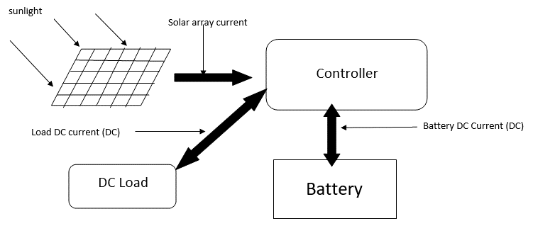

## Thermal management of electric vehicle battery during ultra-fast charging
Ultra-fast charging involves charging a 50 KWh Li-Ion battery within 10-15 minutes. During which around 50W amount of energy is released from a single cell.
The temperature of the battery has to be below 45 degree C so as to avoid a significant reduction in performance as well as life time. 
A cellular level thermal management approach was developed. 

**Preliminary cellular level approach of battery cooling**
A battery is made up of multiple cells as shown in the below figure. The cells are combine together to form a battery module. Multiple modules are brought together to form a battery stack. 

  
  
  <em>Battery cells combined together to form a module</em>
  

**Physics behind cooling cell**
Figure below shows a cooling cell which was initially designed to be placed within two battery cells. 
The cooling cell involved a wick structure which is shown in the figure below as black and white square finish.
The wicking structure is made up of either a copper wick or a polyester material.
The bottom part of the wick has refrigerant in it which absorbs the heat and evaporates and moves upward through the blank space (vapor-chamber) which is cooled at the top and wicked back to the bottom.
This way a continuous cycle of evaporation, condensation and wicking is created due to the heat generated by the internal chemical reaction of the battery.
Thus the battery cell is effectively cooled by the above mentioned cycle.

    
  
  
   <em>Working of Cooling Cell</em>
  

**Results and Conclusion from preliminary design**
The previously mentioned cooling cell had a major drawback. 
There was a temperature gradient of more than 5 degree C  across the battery cell which is a major problem
A temperature gradient of more than 5 degree C could significantly reduce the battery lifetime by a factor of 3.
Hence a new approach was derived.

**New cooling cell based on the results and conclusion of the previous cooling cell**
To maintain a temperature gradient below 50C, Phase Change Material (PCM) was used for uniform distribution of temperature.
For dissipating the large amount of heat generated by the battery heat pipes were used. 
Heat pipes work on the similar principle of evaporation, condensation and wicking as the previous wick structure to dissipate heat.
The heat pipes quickly transported the heat generated inside the battery to the coldplate which dissipated the heat from the heat pipes.

**New cooling cell design**

    
    
        
  
  
  
 <em>Cooling Cell Having PCM (green color) Heat pipe (copper color) and Cold Plate at The Bottom</em>  

  

<em>Cooling Cell Assembly Installed Between Two Battery Cell(Yellow)</em>
  
  

**Results and Conclusion from preliminary design**
The new cooling cell approach was effective in maintaining a uniform temperature distribution across the battery cell which was achieved by the phase change material
The heat pipe was sucesfull in dissipating the heat generated from the battery cell to the coldplate maintaining the temperature below 45 degree C.

## Battery Sizing of Oli and Gas Wells
Renewable energy has been incorporated in major engineering applications especially for remote locations due to the inability of obtaining utility power from the grid. 
The race to reduce gas emissions globally is on the increase, and even the oil and gas sector has implemented the use of solar energy systems with battery storage.
Oil-wells are located at places with varying ambient conditions which affect the performance, safety and lifetime of the battery. Research has shown that with an increase in the ambient temperature, the internal resistance of the battery to corrosion decreases, which tends to reduce the lifetime of the battery. This is an issue in optimum battery sizing of facilities. Temperature also affect the charge storing capacity of the battery.  Other parameters that dictate ambient conditions are duration of sunlight and autonomy, these parameters affect the power generated by each solar panel, charging-discharging cycle and the number of batteries.
In this study considering various conditions like the variation of load, ambient temperature, sunlight exposure, discharge rate and autonomy results were provided based on simulation for number of batteries, capacity, lifetime and cost. 

<em>Basic Schematic of Solar Energy Operated System</em>

<em>Simulation Using Matlab/Simulink For Battery Sizing</em>

**CASE STUDY**
To check the working of the battery sizing model we tested four cases considering varying ambient scenarios. The results of the test are 
shown in the below table.

As mentioned earlier various parameters such as peak sun hour duration, ambient temperature, number of autonomy days, load, depth of discharge plays a vital part in battery sizing.

The number of solar panels decreases with an increase in the peak sun hours as more energy can be generated by a single solar panel. 
The required number of batteries depend on the variation in depth of discharge and autonomy days. With a decrease in depth of discharge the number of batteries increases which can be seen by a comparison between case 1 and case 2. We have developed an alternative equation to consider the fact of zero autonomy days which can be seen from case 4.
With the variation in ambient temperature from the optimum operating condition (25 degree Celsius) for the battery there is a reduction in battery lifetime. We have tested cases for temperatures above and below the optimum value. Apart from the ambient temperature the depth of discharge also plays a major role in deciding the battery lifetime. The variation due to depth of discharge is generally provided by the manufacturer at a constant ambient temperature. We have estimated the lifetime considering both ambient temperature and depth of discharge which can be seen from Case 5 and Case 6.
The results obtained by varying the inputs to various scenarios prove that the above cases test the validity of the model under various extremities. The model provides accurate results to the user and thus based on the number of solar panels and batteries the user can also estimate the cost.

The load has been kept constant for all the cases to get a more in-depth intuition of how other variables affect the battery sizing. Comparing case 1 and case 2 it can be seen how increase in depth of discharge decreases the number of batteries, but it also decreases the battery lifetime. From case 3 and case 4 with decreases in the autonomy days there is a significant decrease in the number of batteries and solar panel required which reduces the cost of sizing. Case 5 and case 6 are the most optimum and most extreme conditions faced by an oil and gas plant. Which results in maximum and minimum battery lifetime respectively.
