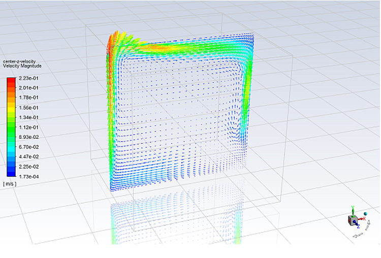

## Radiation and Natural Convection
In this project I Used surface to surface model in ANSYS Fluent to model a 3-D room with one heated wall and the room is subjected to radiative and convective heat transfer to the surrounding and computed the temperature patterns inside the room and wall heat flux

  
  
  <em>Contour of static temperature</em>
  
  
  
  
  

  <em>Contour of wall temperature</em>  
  
  
  
  
  
  <em>Contour of radiation heat flux</em> 
  
  
  
  
  
  
  <em>Vector of velocity magnitude</em>
    

## Multi-phase Modeling and Simulation 
Modeled melting of phase change material using solidification liquefaction model in ANSYS Fluent
Reduced the Mushy zone using advanced and adaptive meshing technique

  
  
  <em>Contour of liquid fraction</em>
  
  
  
  
  

  <em>Contour of temperature fraction</em>

## Analysis of Mixing Effect Inside a Nozzle
In this project I Investigated the mixing effect inside a converging and diverging nozzle having a injector at the neck by varying the injector pressure to different values in ANSYS Fluent.

  
  
  <em>Velocity contour</em>
  
  
  
  
  

  <em>Pressure contour</em>
  
  
  
  
  

  <em>Temperature contour</em>
  
  ## Aerodynamics of an Unmanned Vehicle
Investigated the air flow around an unmanned vehicle using Ansys Fluent.

  
  
  <em>Velocity contour</em>
  
  
  
  
  

  <em>Pressure contour</em>
  
  
  
  
  
  <em>Pressure contour</em>
  
  
  
  
  

  <em>Turbulence contour</em>

## Measurement of Critical Velocity For The Detachment of Water Droplet From The Solid Surface 
The liquid droplet adherence and detachment from a solid surface has received considerable attention due to its importance in many engineering applications such as surface decontamination, oil recovery, condensers, air conditioning systems etc.., In an air conditioning system if some liquid contaminants are detached from the ventilation duct surface and supplied to the room, then the supplied air quality would decrease which is not desirable. In oil recovery also this concept has applications, the oil recovery depends on the ability of the fluid to displace oil droplets. In condensers the liquid droplet detachment from the condensing surface is of much importance because the droplet has to be removed from the condensing surface so that new vapor comes into contact with the condensing surface. 

  
  
  <em>Volume Fraction and Velocity Profile for Velocity v = 0.1 to 0.3 m/s </em>
  
  
  
  
  

  <em>Volume Fraction and Velocity Profile for Velocity v = 0.5 to 0.8 m/s </em>
  
  
  
  
  

  <em>Volume Fraction and Velocity Profile for Velocity v = 1 m/s </em>
  
  
As the air velocity increases the deformation increases and at an air velocity of 1m/s the air can be able to deform and detach the droplet partially from the surface. 
So the critical velocity for detaching the droplet of 500 micron diameter from a surface having contact angle of 1300 is around 1m/s. 	
