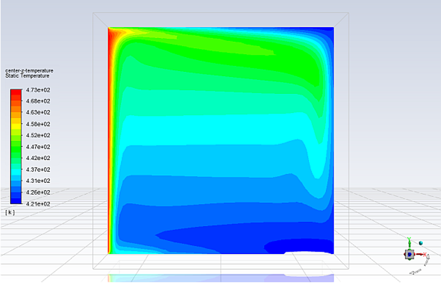
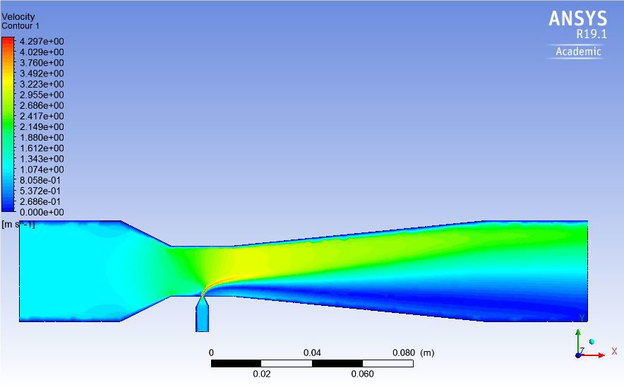

## RADIATION AND NATURAL CONVECTION
In this project I Used surface to surface model in ANSYS Fluent to model a 3-D room with one heated wall and the room is subjected to radiative and convective heat transfer to the surrounding and computed the temperature patterns inside the room and wall heat flux

  
  
  <em>Contour of static temperature</em>
  
  
  
  
  

  <em>Contour of wall temperature</em>  
  
  
  
  
  
  <em>Contour of radiation heat flux</em> 
  
  
  
  
  
  
  <em>Vector of velocity magnitude</em>
    

## Multi-phase Modeling and Simulation 
Modeled melting of phase change material using solidification liquefaction model in ANSYS Fluent
Reduced the Mushy zone using advanced and adaptive meshing technique

  
  
  <em>Contour of liquid fraction</em>
  
  
  
  
  

  <em>Contour of temperature fraction</em>

## Analysis of Mixing Effect Inside a Nozzle
In this project I Investigated the mixing effect inside a converging and diverging nozzle having a injector at the neck by varying the injector pressure to different values in ANSYS Fluent.

  
  
  <em>Velocity contour</em>
  
  
  
  
  

  <em>Pressure contour</em>
  
  
  
  
  

  <em>Temperature contour</em>
  
  ## Aerodynamics of an Unmanned Vehicle
Investigated the air flow around an unmanned vehicle using Ansys Fluent.

  
  
  <em>Velocity contour</em>
  
  
  
  
  

  <em>Pressure contour</em>
  
  
  
  
  
  <em>Pressure contour</em>
  
  
  
  
  

  <em>Turbulence contour</em>
