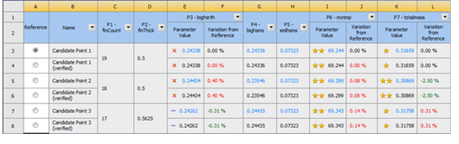
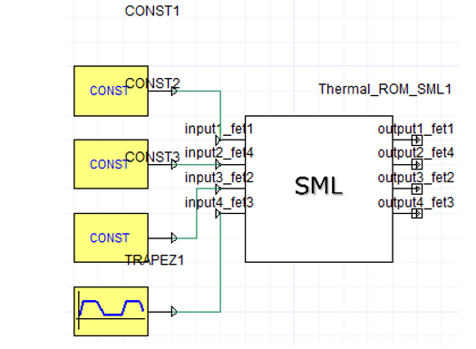
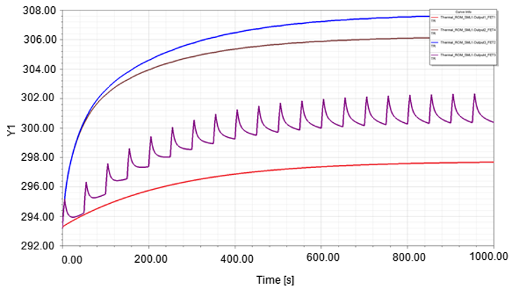
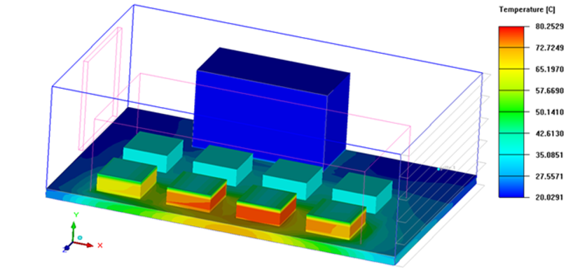
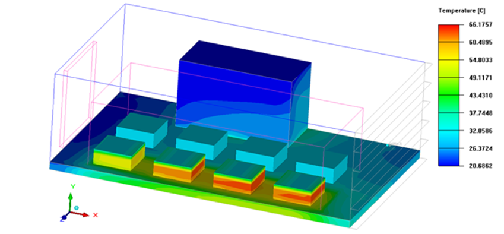
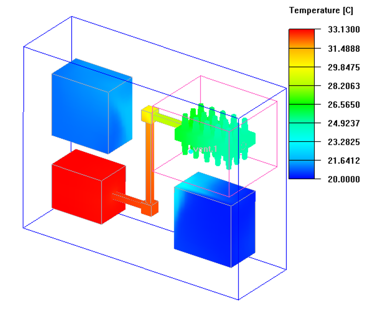

## Minimizing Thermal Resistance
In this project I Optimized a heat sink using ANSYS Icepack by minimizing the thermal resistance and reducing the amount of material with temperature constraint of 70 degree Celsius and restrained the total mass of the heat sink to 0.326 Kg
Developed a model composed of FR-4 board of 20.32 cm * 30.48 cm and 1.59 mm thick with CPU dissipating 50 W and a heat sink placed on top of it
Successfully optimized the heat sink by finding a best case with a fin count of 19 fins each of 0.5 mm thickness keeping the system at 69.244 degree Celsius and heat sink mass to 0.31659 Kg

  
  
  <em>Table of Optimization, Candidate points</em>

  
## Reduced Ordered Model 
Created a step response file using ANSYS Icepack and created a Reduced Ordered Model (ROM) in ANSYS Twin Builder to determine the temperature rise from 4 Field Effect Transistor (FET) placed on board which are thermally managed by forced convection
Create a ROM which can efficiently calculate temperatures at the pre-defined outputs under any transient heat dissipation scenario

  
  
  <em>Schematic of Reduced Ordered Model (ROM)</em>
  
  
  
  
  

  <em>Temperature Results</em>

 ## Parameterization Using ANSYS Icepack to Optimize Fan Location
Developed a system level model consisting of series of IC chips on a PCB which is cooled by a fan via forced convection having a bonded fin extruded heat sink attached to the IC chip
Carried a study to determine the optimum location of the fan using the parametrization study feature in ANSYS Icepack 
Specified a dynamically updating fan curve and used separate mesh assemblies to reduce the mesh count and generated a summary report for multiple solutions

  
  
  <em>Trial 1</em>
  
  
  
  
  

  <em>Trial 2</em>

## Heat Pipe Modeling and Nested Non-Conformal Meshing
Modeled a heat pipe with orthotropic conductivity with a very large conductivity in the pipe axis direction that connects the heat source to the air-cooled heat sink
Used nested non-conformal meshing using assemblies in ANSYS Icepack to reduce the cell count in the model and thus reducing the time 
Increase slack values for faces with a wake region to model the wake more accurately 

  
  
  <em>Temperature contour</em>
  
  
  
  
  

  <em>Velocity vector field around fan and heat sink</em>
