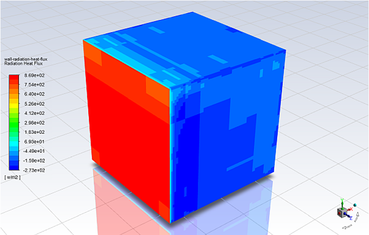

## Minimizing Thermal Resistance
In this project I Optimized a heat sink using ANSYS Icepack by minimizing the thermal resistance and reducing the amount of material with temperature constraint of 70 degree Celsius and restrained the total mass of the heat sink to 0.326 Kg
Developed a model composed of FR-4 board of 20.32 cm * 30.48 cm and 1.59 mm thick with CPU dissipating 50 W and a heat sink placed on top of it
Successfully optimized the heat sink by finding a best case with a fin count of 19 fins each of 0.5 mm thickness keeping the system at 69.244 degree Celsius and heat sink mass to 0.31659 Kg

  
  
  <em>Contour of static temperature</em>
  
  
  
  
  

  <em>Contour of wall temperature</em>  
  
  
  
  
  
  <em>Contour of radiation heat flux</em> 
  
  
  
  
  
  
  <em>Vector of velocity magnitude</em>
    

## Multi-phase Modeling and Simulation 
Modeled melting of phase change material using solidification liquefaction model in ANSYS Fluent
Reduced the Mushy zone using advanced and adaptive meshing technique

  
  
  <em>Contour of liquid fraction</em>
  
  
  
  
  

  <em>Contour of temperature fraction</em>

